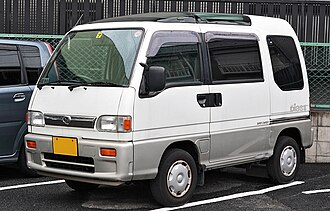
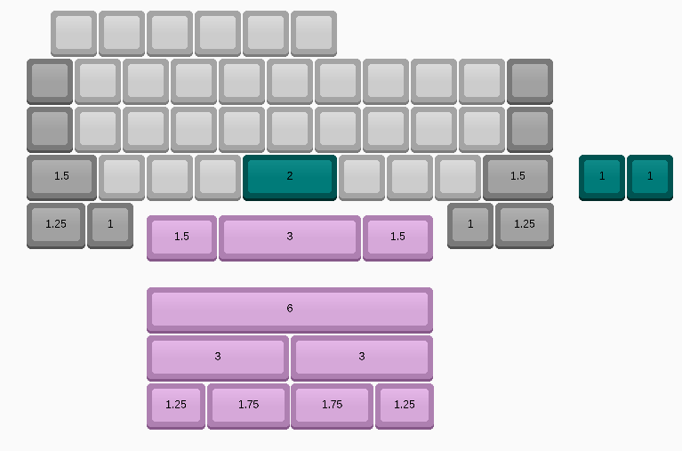
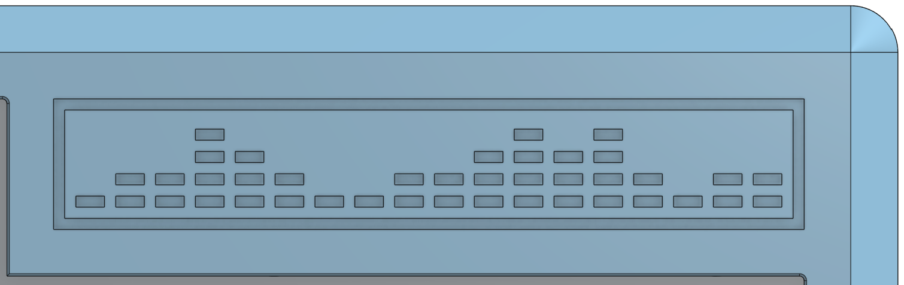
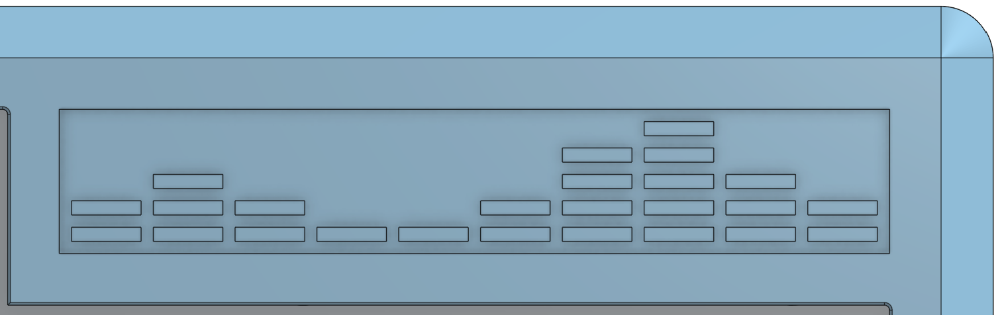

# BEEP
Case for the Sambar PCB by Dashkeebs (See his [github](https://github.com/DashDashUnderscoreDash/) or [store](https://www.dashkeebs.com/))

  
  

  <i>Pictures from Dash (slightly older prototype)</i>

Case design inspired by the PCB's namesake, the humble Subaru Sambar

  

  <i>Picture from the <a href="https://en.wikipedia.org/wiki/Subaru_Sambar">Wikipedia article</a></i>

## KLC
PCB is an 11u, alpha stagger-ed, exploded bar-ed, half numrow-ed *beast*. See layout options below:

## Build notes
There are two badge options. In my opinion, the outset badge looks cooler, but it can be a pain to print. The inset badge is also an option.

There is a **fake screw-hole** on the bottom case. We wanted additional screws for some support, but the top side of the case is taken up by the tadpoles on one side. To maintain some symmetry, a fake screw-hole was added. This is not a model error, it's an aesthetic choice

## Required hardware
* M2×4mm screws *(11×)*
* M2×3mm heatset inserts *(11×)*
* SKUF Feet *(4×)*
* Geon tadpoles *(8×)*
  * US vendor: [Saberkeebs](https://saberkeebs.com/products/geon-tadpoles)
  * Worldwide vendor: [Geon](https://geon.works/products/tadpole)
* JST Unified Daughterboard (C3)
* Sambar PCB (See [dashkeebs]((https://www.dashkeebs.com/))

## Acknowledgements
* Much appreciation to Dash (DashDashUnderscoreDash (--_-)) for helping me out with the design and bringing the idea to life with a PCB! Again, go check him out and support him: [github](https://github.com/DashDashUnderscoreDash/) or [store](https://www.dashkeebs.com/)
* The case design and layout were both inspired by some of Cain from MechVault's work, go check him out too: [MechVault](https://mechvault.net/)
